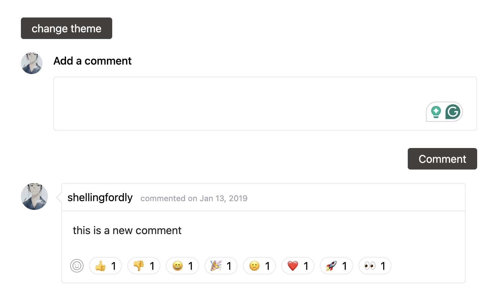
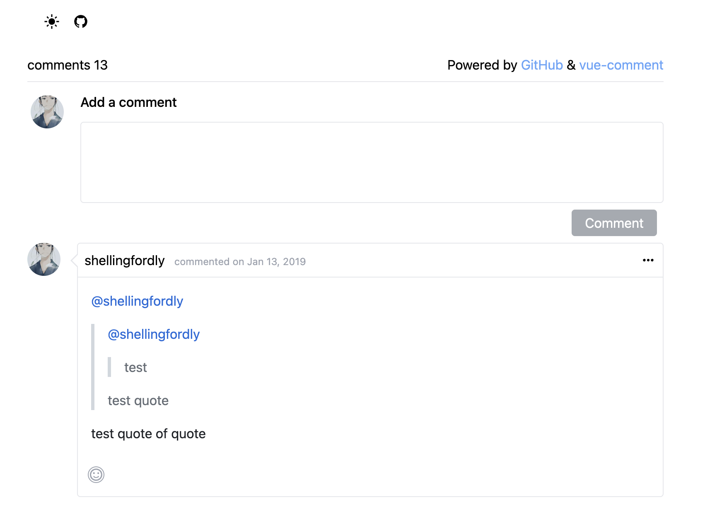

# Vue Comment

[WIP]

This is a issue-based vue-comment component. It‘s inspiration comes in [vssue](https://github.com/meteorlxy/vssue).

If you config Github-OAuth config, and create first issue, you can view all comments and add comment of the issue.

## Config

set github config

get clientId and clientSecret form "New OAuth App"

```bash
VITE_CLIENT_ID=replace_me
VITE_CLIENT_SECRET=replace_me
VITE_GITHUB_AUTHOR=replace_me
VITE_GITHUB_REPO=replace_me
```

## Run

```
pnpm install
pnpm run dev
```

## Contributing

📜 Feel free to open issues following the issue templates if you have any problems or ideas.

❤️ Contributions welcome very much!

## Preview



quote replay


